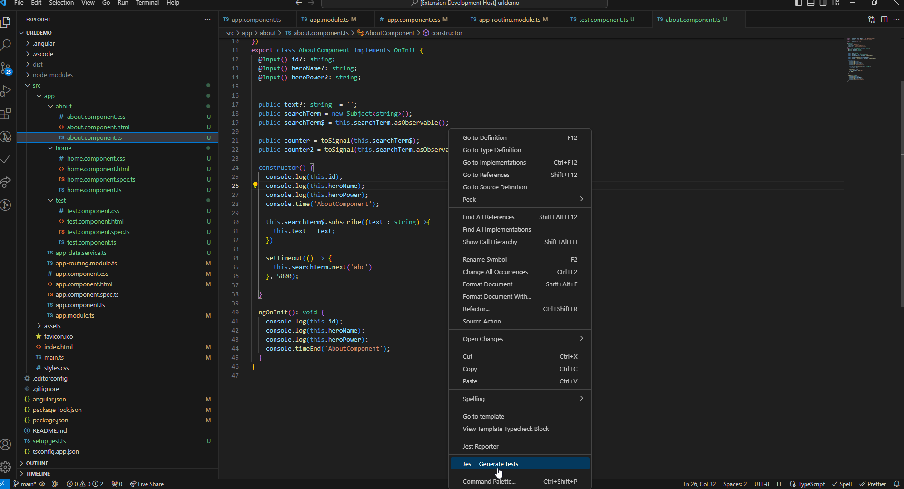

# Titan JS README

This is the README for "Jest Reporter - generator". Used only if you are working with the Jest and Angular.

## Features

Add a menu in the explorer, it allows create the file needed to test the component 

## Release Notes

### 0.0.2

some bugs were resolved

### 0.0.1

Initial release of a beta version of the plugin
This version may not generate any files.

### For more information

@autor (edwinandeka@gmail.com) 
Edwin Ramiro Ospina Ruiz

#Contact Us

* [Dowesoft](https://dowesoft.com/page/)
* [Github](https://github.com/edwinandeka)

**Thanks!**
